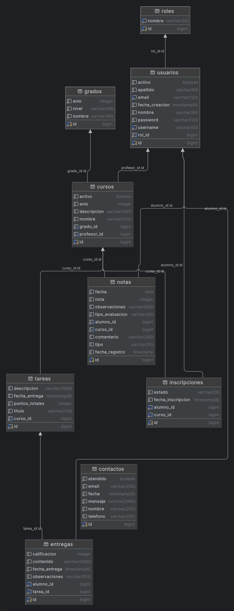
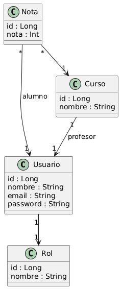

# Colegio Elim Project

Colegio Elim Project es una plataforma web integral para la gestión académica y administrativa del Colegio Elim San Lucas.  
El sistema permite manejar usuarios, roles, notas, grados, secciones, docentes, alumnos y comunicación interna.  

Desarrollado con una arquitectura moderna Spring Boot + React + PostgreSQL + JWT, siguiendo principios de seguridad, escalabilidad y mantenibilidad.

---

## Índice

1. Resumen del Proyecto
2. Arquitectura General
3. Tecnologías Utilizadas
4. Estructura del Proyecto
5. Instalación y Configuración
6. Autenticación y Seguridad
7. Roles y Permisos
8. Endpoints Principales
9. Base de Datos
10. Despliegue
11. Casos de Uso
12. Diagramas UML
13. Pruebas y Validaciones
14. Mantenimiento y Futuras Mejoras
15. Autores

---

## Resumen del Proyecto

El Sistema de Gestión Escolar Colegio Elim tiene como propósito digitalizar los procesos del colegio mediante módulos de:

- Administración de usuarios y roles (Administrador, Docente, Alumno, Externo)
- Gestión académica (Grados, Cursos, Notas, Tareas)
- Comunicación interna (Contactos y avisos)
- Seguridad mediante autenticación JWT
- Paneles personalizados por rol

---

## Arquitectura General

El sistema sigue una arquitectura **Cliente-Servidor**, donde el **frontend React** (cliente) consume servicios REST del **backend Spring Boot** (servidor).  
Internamente, el backend implementa una **arquitectura en capas**, que separa las responsabilidades para mejorar la mantenibilidad y escalabilidad.

### Capas del Backend

| Capa | Descripción |
|------|--------------|
| **Controller (Presentación)** | Gestiona las peticiones HTTP, recibe datos del cliente y retorna respuestas. |
| **Service (Lógica de negocio)** | Contiene las reglas de negocio, validaciones y procesos intermedios. |
| **Repository (Persistencia)** | Interactúa directamente con la base de datos mediante JPA/Hibernate. |
| **Model (Entidad y DTOs)** | Define las clases que representan los datos y sus estructuras de transporte. |
| **Security** | Implementa autenticación y autorización JWT, junto con filtros de seguridad. |
| **Config** | Contiene la configuración de CORS, beans y parámetros globales. |

### Diagrama esquemático

```
React (Frontend)
       │
       ▼
[ Controller Layer ]
       │
       ▼
[ Service Layer ]
       │
       ▼
[ Repository Layer ]
       │
       ▼
PostgreSQL (Base de Datos)
```

---

## Tecnologías Utilizadas

**Backend:** Java 17, Spring Boot 3, Spring Security, Spring Data JPA, Lombok, PostgreSQL  
**Frontend:** React 18, TypeScript, TailwindCSS, Axios, React Router, Lucide Icons  

---

## Estructura del Proyecto

```
colegio-elim-project/
│
├── backend/
│   ├── config/
│   ├── controller/
│   ├── model/entity/
│   ├── repository/
│   ├── service/
│   └── security/
│
├── frontend/
│   ├── components/
│   ├── pages/
│   ├── services/
│   ├── assets/
│   └── App.tsx
│
└── docs/
    └── ER_proyect_elim.png
```

---

## Instalación y Configuración

1. Clonar el repositorio  
```bash
git clone https://github.com/tuusuario/colegio-elim-project.git
cd colegio-elim-project
```

2. Configurar el backend  
```bash
cd backend
mvn clean install
```
Editar `application.properties`:
```properties
spring.datasource.url=jdbc:postgresql://localhost:5432/colegio_elim
spring.datasource.username=postgres
spring.datasource.password=tu_password
spring.jpa.hibernate.ddl-auto=update
jwt.secret=una_clave_super_larga_muy_secreta_para_hmac256
jwt.expiration=86400000
```

3. Ejecutar el backend  
```bash
mvn spring-boot:run
```

4. Configurar el frontend  
```bash
cd frontend
npm install
npm run dev
```

---

## Autenticación y Seguridad

- Autenticación mediante JWT (JSON Web Tokens).
- Filtro `JwtAuthenticationFilter` protege rutas.
- Soporte completo para CORS.

Cabecera de autenticación:
```http
Authorization: Bearer <token>
```

---

## Roles y Permisos

| Rol | Descripción | Accesos |
|------|--------------|----------|
| ADMIN | Superusuario | Gestión completa |
| DOCENTE | Profesor registrado | Registro y revisión de notas |
| ALUMNO | Estudiante | Consulta de notas y tareas |
| EXTERNO | Público general | Contacto y vista informativa |

Cada rol posee su propio Dashboard y Header.

---

## Endpoints Principales

| Método | Endpoint | Descripción |
|--------|-----------|-------------|
| POST | `/api/auth/login` | Inicia sesión y genera JWT |
| GET | `/api/usuarios` | Lista usuarios |
| POST | `/api/usuarios` | Crea usuario |
| GET | `/api/grados` | Lista grados |
| GET | `/api/cursos` | Lista cursos |
| POST | `/api/contacto` | Envía formulario de contacto |
| GET | `/api/notas` | Obtiene notas por alumno |

---

## Base de Datos

### Diagrama ER


Incluye las siguientes tablas principales:
- roles
- usuarios
- grados
- cursos
- notas
- tareas
- entregas
- inscripciones
- contactos

Cada una está documentada con sus campos y relaciones en el archivo original del modelo entidad-relación.

---

## Despliegue

### Backend (Tomcat)
```bash
mvn clean package
cp target/colegio-elim-project.war /opt/tomcat/webapps/
sudo systemctl restart tomcat
```

### Frontend (Producción)
```bash
npm run build
```
Luego subir el contenido de `/dist` al servidor web.

---

## Casos de Uso

- Login con JWT y redirección por rol.  
- Docente registra notas.  
- Alumno consulta calificaciones.  
- Contacto público desde la web.  
- Administración de cursos y grados por rol ADMIN.

---

## Diagramas UML

### Diagrama de Clases (simplificado)


---

## Pruebas y Validaciones

- Validación de correo con `@`  
- Validación de teléfono (solo números, 8 dígitos)  
- Pruebas de endpoints protegidos con JWT  
- Validación de formularios vacíos o incorrectos  

---

## Mantenimiento y Futuras Mejoras

- Integración con Docker Compose  
- Sistema de notificaciones internas  
- Reportes PDF por alumno  
- Integración con correo institucional  

---

## Autores

Equipo de Desarrollo Colegio Elim Project  
Emerson Antonio Sec Prera – Desarrollador Full Stack / Líder de Proyecto

© 2025 Colegio Elim San Lucas – Todos los derechos reservados.
